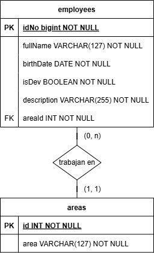

# 📌 Challenge de ingreso

## 📖 Descripción

Este proyecto contiene el ejercicio de ingreso/entrevista para el puesto de desarrollador web en la DGGSM.

## 🚀 Niveles

El proyecto se separa en 5 niveles:

| Hecho | Nivel             | Descripción                                 |
| :---: | ----------------- | ------------------------------------------- |
|  ✅   | Repositorio       | Creación de repositorio                     |
|  ✅   | Backend           | Desarrollo de servidor para API REST        |
|  ✅   | Base de datos     | Elección y creación de BDD, DER y consultas |
|  ✅   | Frontend          | Desarrollo de página web                    |
|       | Testeo automático | Desarrollo de pruebas                       |

## 🌌 API Endpoints

#### GET | /employees

Trae una lista de todos los empleados.

#### GET | /employees/_:idNo_

Trae al empleado cuya propiedad `idNo` coincida con el del parámetro de ruta.

#### POST | /employees

Agrega un empleado a la lista.

Cuerpo de la petición:

```
{
  fullName: "Nombre Apellido",
  idNo: 12345678,
  birthDate: "YYYY/M/D",
  isDev: true/false,
  description: "Breve descripción.",
  area: 101,
}
```

#### PUT | /employees/_:idNo_

Modifica al empleado cuya propiedad `idNo` coincida con el del parámetro de ruta.

El cuerpo de la petición puede contener cualquiera de estas propiedades:

- **fullName**: "Nombre Apellido"
- **idNo**: 12345678
- **birthDate**: "YYYY/M/D"
- **isDev**: true/false
- **description**: "Breve descripción."
- **areaId**: 101

#### DELETE | /employees/_:idNo_

Elimina al empleado cuya propiedad `idNo` coincida con el del parámetro de ruta.

---

#### GET | /areas

Trae una lista de todas las áreas de trabajo.

#### GET | /areas/_:id_

Trae el área de trabajo cuya propiedad `id` coincida con la del parámetro de ruta.

#### POST | /areas

Agrega un empleado a la lista.

Cuerpo de la petición:

```
{
  area: "Área de trabajo",
}
```

#### PUT | /areas/_:id_

Modifica el área cuya propiedad `id` coincida con el del parámetro de ruta.

El cuerpo de la petición debe contener la propiedad **area**: "Descripción del área".

#### DELETE | /areas/_:id_

Elimina el área de trabajo cuya propiedad `id` coincida con la del parámetro de ruta.

## 💾 Base de Datos

#### Elección

Opté por usar la base de datos MariaDB, debido a que ya he trabajado con ella y es la que forma parte de la interfaz phpMyAdmin y servidor XAMPP.

#### DER



#### 🔍 Consultas básicas

**Obtener todas las áreas**

```
SELECT * FROM AREAS;
```

Devuelve la lista de áreas registradas.

---

**Obtener todos los empleados**

```
SELECT * FROM EMPLOYEES;
```

Devuelve la lista de empleados con todos sus datos.

---

**Obtener empleados de un área específica**

```
SELECT * FROM EMPLOYEES WHERE areaId = 101;
```

Filtra empleados por área.

---

**Buscar empleados por nombre**

```
SELECT * FROM EMPLOYEES WHERE fullName LIKE '%Texto%';
```

Encuentra empleados cuyo nombre contenga cierto texto.

#### 🔄 Consultas de inserción

**Agregar un área**

```
INSERT INTO AREAS (area) VALUES ('Nombre del Área');
```

Registra una nueva área.

---

**Agregar un empleado**

```
INSERT INTO EMPLOYEES (fullName, idNo, birthDate, isDev, description, areaId)
VALUES ('Juan Pérez', 123456789, '1990-05-20', TRUE, 'Desarrollador Senior', 101);
```

Agrega un nuevo empleado.

#### 📝 Consultas de actualización

**Actualizar datos de un empleado**

```
UPDATE EMPLOYEES
SET fullName = 'Nuevo Nombre', description = 'Nueva descripción'
WHERE idNo = 123456789;
```

Modifica información de un empleado.

---

**Actualizar el área de un empleado**

```
UPDATE EMPLOYEES SET areaId = 2 WHERE idNo = 123456789;
```

Cambia a un empleado de área.

#### ❌ Consultas de eliminación

**Eliminar un empleado**

```
DELETE FROM EMPLOYEES WHERE idNo = 123456789;
```

Borra un empleado de la base de datos.

---

**Eliminar un área (si no tiene empleados asignados)**

```
DELETE FROM AREAS WHERE id = 105;
```

Borra un área de la base de datos.

## 👨‍💻 Cómo ejecutar

Asegúrese de tener instalado [Node.js](https://nodejs.org/en/download). Si no está seguro de tenerlo instalado, ejecute los siguientes comandos en su terminal:

```
# Verifica versión de Node.js
node -v

# Verifica versión de npm
npm -v
```

#### 1. Proyecto

Paso 1: Descargue o clone el proyecto utilizando la [URL](https://github.com/MarcosLaporte/Challenge-DGGSM.git) o Github Desktop.

#### 2. Base de datos

Paso 2: Abra su cliente SQL preferido y ejecute la query almacenada en [el archivo creation_query.sql](./creation_query.sql).

#### 3. Backend

Paso 3: Abra su terminal y navegue hasta la carpeta /backend del proyecto.

```
cd su/ruta/Challenge-DGGSM/backend
```

---

Paso 4: Instale las dependencias.

```
npm i
```

---

Paso 5: Cree un archivo llamado `.env` dentro de /backend y complete dentro del mismo según la configuración del cliente de su base de datos:

```
DB_HOST=su_host
DB_USER=su_usuario
DB_PASSWORD=su_contraseña
DB_NAME=nombre_base_de_datos
DB_CONNECTION_LIMIT=(1-10)
```

---

Paso 6: Ejecute el servidor.

```
npm run dev
```

#### 4. Frontend

Paso 7: Abra su terminal y navegue hasta la carpeta /frontend del proyecto.

```
cd su/ruta/Challenge-DGGSM/frontend
```

---

Paso 8: Instale las dependencias.

```
npm i
```

---

Paso 9: Ejecute el servidor de Angular.

```
npm start
```

#### 5. Tests

Para ejecutar los casos de prueba para testear la API, ejecute el siguiente comando en su terminal, dentro de la ruta /backend.

```
npm test
```

---

## 📦 Paquetes

- `Express.js` - Framework para la API
- `mysql2` - Cliente mySQL para Node
- `dotenv` - Módulo para cargar variables de entorno
- `cors` - Connect/Express middleware
- `sweetalert2` - Librería para mensajes pop-up
- `jest `- Framework para los tests
- `supertest `- Librería para testear peticiones HTTP
